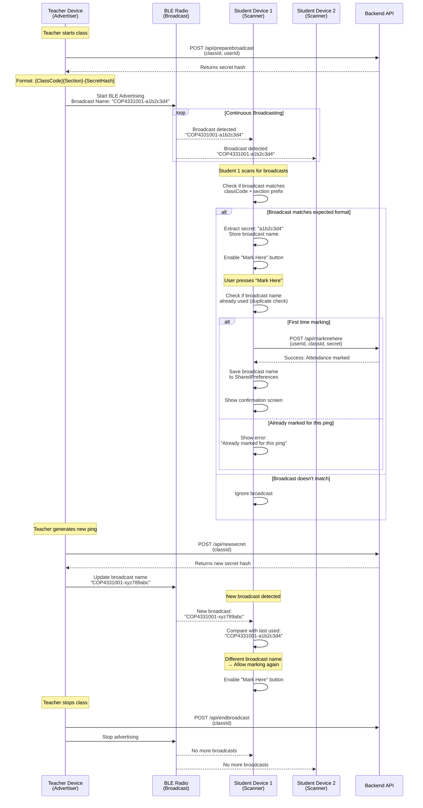
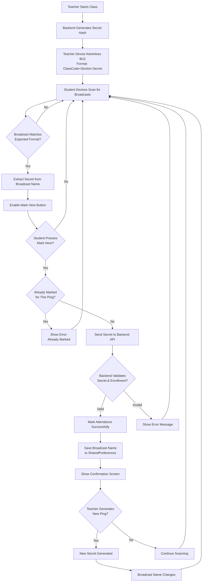

# Bluetooth BLE Attendance System Flow

## Simplified Flow Diagram

## Key Components

### BLE Advertising (Teacher Side)
- **Format**: `{ClassCode}{Section}-{SecretHash}`
- **Example**: `COP4331001-a1b2c3d4`
- **Frequency**: Continuous broadcast every few seconds
- **Range**: ~10-30 meters (indoor)

### BLE Scanning (Student Side)
- **Mode**: Passive scanning (no connection required)
- **Filter**: Checks if broadcast name starts with `{ClassCode}{Section}-`
- **Detection**: Receives broadcast packets without pairing

### Duplicate Prevention
- **Storage**: SharedPreferences (persists across app restarts)
- **Key**: `lastUsedBroadcast_{classId}`
- **Logic**: Compare current broadcast name with last used
- **Result**: Same name = block, Different name = allow

### Security
- **Secret Hash**: Unique per ping/session
- **Validation**: Backend verifies secret matches active session
- **Enrollment Check**: Backend verifies student is enrolled in class

